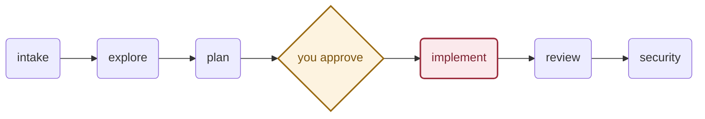
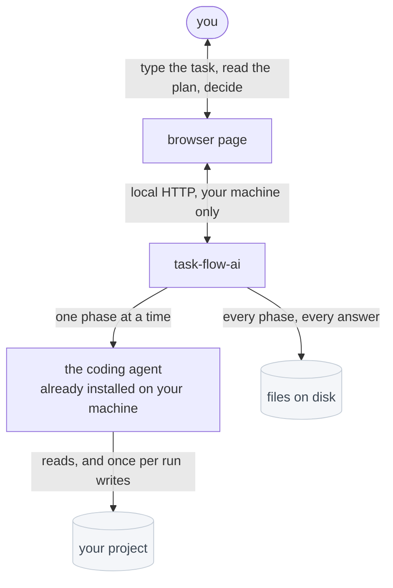
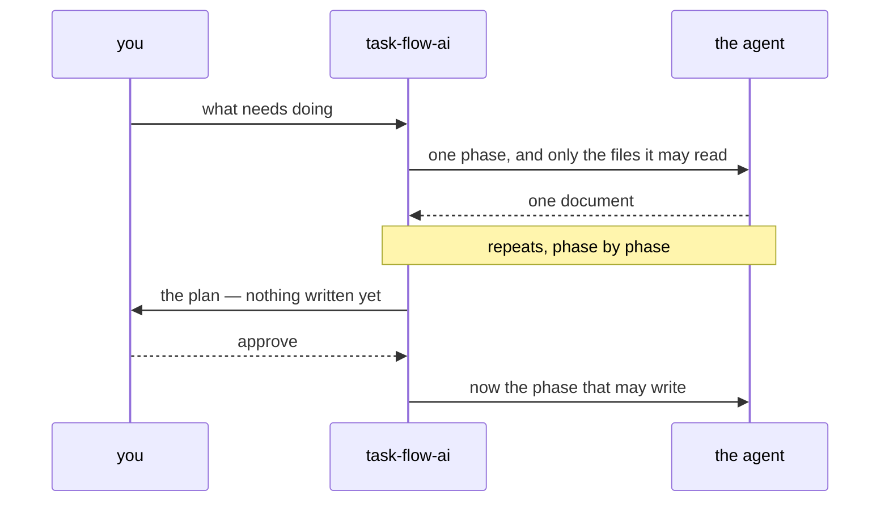
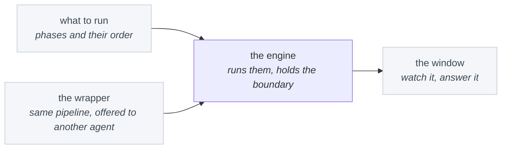

# task-flow-ai

**A coding agent that stops and asks before it writes.**

One agent doing everything carries two hundred messages of context and, halfway
through, has forgotten what it decided at the start. `task-flow-ai` splits the
work into six phases. Each one is a fresh agent that reads only what the phase
before it wrote down — and the whole thing stops and shows you the plan before a
single line of your code is touched.



Only **implement** can change your code. The other five can read your project
and nothing else — not by instruction, but because they are never handed a tool
that writes.

Every phase leaves its file in `.taskflow/runs/<id>/`, so a run can be reread
tomorrow, argued with, and resumed after a crash.

## Install

Needs [Claude Code](https://claude.com/claude-code) installed and signed in, and
Node 20 or newer.

```bash
git clone https://github.com/AleAlle62/task-flow-ai
cd task-flow-ai
npm install && npm run build && npm link
```

Or run it inside Claude Code as a plugin instead:

```bash
claude plugin marketplace add AleAlle62/task-flow-ai
```

## Use it

There is one command. Go to your project and run it:

```bash
task-flow-ai run
```

Your browser opens, you type what needs doing, and the run starts. From then on
the page shows the six phases across the top, which one is working, and what it
has cost so far in time, tokens and money. The plan waits for you there.

If you would rather say it up front, say it:

```bash
task-flow-ai run "fix the empty cart bug"
```

That is the whole surface. One option exists, for when you want the phases on a
cheaper or a stronger model:

```bash
task-flow-ai run --model claude-haiku-4-5
```

Everything else the command works out for itself:

| | |
| --- | --- |
| An unfinished run in this project | it offers to continue it, so you do not pay twice for the phases that finished |
| Port `4179` already busy | it takes a free one |
| No browser, or no way to open one | it asks in the terminal instead |
| A project carrying its own phases | it names the files and asks before using them |

Before anything runs it prints the flow it is about to follow — every phase,
what it reads, what it may do, where it stops — so you can read what is about to
be allowed before it happens.

Inside Claude Code, the plugin gives you the same pipeline as a command:

```
/task-flow-ai fix the empty cart bug
```

## The six phases

Each one is a separate run of the agent. It is handed the files the phases
before it wrote, and nothing else — no shared conversation, no memory of how the
last one felt about it.

| Phase | Produces | May do |
| --- | --- | --- |
| **intake** | what you actually asked for, written down | read |
| **explore** | where things are in your code, and how they really work | read, look around |
| **plan** | the approach, the steps, the risks | read, look around |
| ⏸ **you decide** | approval, and a note if you want one | — |
| **implement** | the change, and a report of what it did | **write, run commands** |
| **review** | what is wrong with the change | read, look around |
| **security** | what the change exposed | read, look around |
| ⏸ **you decide** | accept, or send it back | — |

Two of those rows are you. That is the product.

## How it fits together

Three parts, and the arrows only ever point one way.



**task-flow-ai** holds the order: which phase is next, what it may read, when to
stop and ask. It does not think about your code — it never sees a model.

**The coding agent** does the thinking. It is the one you already installed and
signed in, running on your account. This project has no service of its own, so
nothing about your code goes anywhere it was not already going.

**The browser page** exists for one reason: a plan is a page of prose, and a
terminal is a poor place to read one and decide. It is served by the tool
itself, on your machine only, and it disappears when the run ends. Turn it off
and the pipeline is unchanged — it asks in the terminal instead.

## What a run actually does



Nothing is written to your code until the stop in the middle has an answer.
Everything before it is reading and writing documents.

## Where the boundary actually is

One phase may change your code. That is not a promise in a prompt — it is
checked in four places, at four different moments.

| When | What happens |
| --- | --- |
| **When you write a phase** | it declares what it may do, in five plain words: read, search, look around, run commands, write |
| **Before anything runs** | a pipeline where two phases could change your code is refused, and the run never starts |
| **While a phase runs** | the agent is handed only that phase's tools — a phase without *write* has no way to write, whatever it decides |
| **Around every command** | the shell it gets is walled in: no network, no credentials, no touching how your machine starts |
| **After the writing phase** | files touched outside the allowed paths are named, and the run fails |

The first four prevent. The last one only reports — but it reports on the
difference the phase made, not on work you had already done yourself.

### Why the walls, when the tools are already limited

Deciding *which commands* a phase may run says nothing about what those commands
can reach once they are running. `cat` is a perfectly reasonable thing to allow;
`cat ~/.ssh/id_rsa` is the same command. And the phase that writes has to be able
to run your tests, which means running commands you did not enumerate.

So every phase runs sandboxed:

- **No network at all.** Not an allowlist with a few holes — an empty one. This
  is what turns "a phase was talked into running curl" from a breach into a
  failed command.
- **No credentials.** SSH keys, cloud config, registry tokens: reads refused.
- **No changing how your machine starts.** Shell startup files, login items.

Each of those was checked by running it, not by reading the documentation.

### What is still only as strong as your attention

Your project's content reaches the phases — that is the job — and a file in it
can contain sentences addressed to the agent. Phases are told that everything
quoted to them is material and never instruction, and no document can forge the
markers that separate the two.

But it ends up in the plan, and the plan is the thing you approve. Read it.
That is what the stop is for.

## What is left behind

One directory per run, in plain files: every phase's document, your answers, and
a log of everything that happened, in order.

That is what makes a run rereadable tomorrow, resumable after a crash, and
watchable by something that is not this program. There is no database and no
account — delete the directory and the run is gone.

## Making it yours

The phases are markdown files: instructions on top, a line saying what each may
do. The order is one small YAML file. Neither mentions a vendor.

Do not like how review judges severity? Edit that phase. Want a seventh phase
for performance? Write it and add it to the order. No code changes either way.

A project can carry its own copies. When one does, the run names the files and
asks before using them — they arrive with the repository, and a phase file is a
set of instructions to an agent.

## Running it on a different agent

The engine talks to one small interface: run a phase, give back its text,
translate the five capabilities into whatever your agent calls them, and say how
much of that list you can actually hold it to.

One rule, not negotiable: an agent is listed here only once someone has run the
whole pipeline on it for real. Which is why the list is currently one.

## How the repository is organised

Four areas. The dependencies point one way and never back.



The phases and the order are plain files a person edits — they are the product,
and they know nothing about the code that runs them. The engine reads them,
keeps the boundary, and stores the result. The window talks to the engine over
local HTTP and holds no logic of its own. Which is why swapping the agent
underneath touches one folder, and why a run works with the window closed.

**[The illustrated map →](docs/index.html)** — every folder, what it decides,
and why it is separate.

## License

MIT
