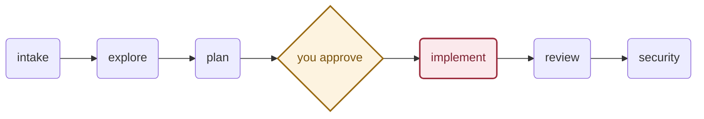
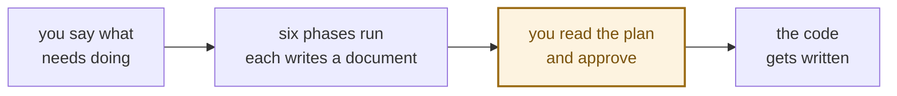
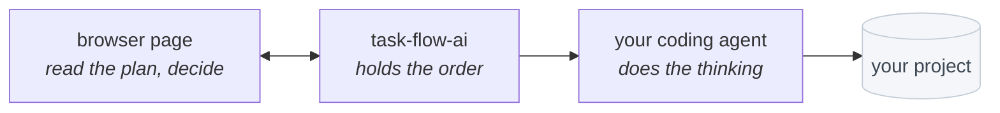
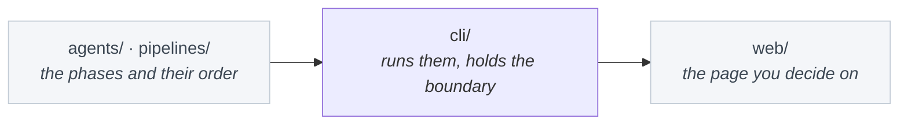

# task-flow-ai

**A coding agent that stops and asks before it writes.**

## The problem

You give a coding agent a task. It reads, decides, and edits — all in one go,
carrying two hundred messages of context. By the time it touches your code you
have no idea what it decided, and by the time you find out, it is already done.

`task-flow-ai` splits that into six phases. Each is a fresh agent that reads
only what the phase before it wrote down. It stops in the middle and shows you
the plan. Nothing is written until you say so.



Only **implement** can change your code. The other five never get a tool that
writes, so it is not a rule they are asked to follow.

## Install

Needs [Claude Code](https://claude.com/claude-code) installed and signed in, and
Node 20 or newer.

```bash
npm install -g @alealle62/task-flow-ai
```

Or, if you use an agent that reads skills — Claude Code, Cursor, Copilot and a
dozen others — install it as one:

```bash
npx skills add https://github.com/AleAlle62/task-flow-ai
```

Or as a Claude Code plugin:

```bash
claude plugin marketplace add AleAlle62/task-flow-ai
```

To work on it rather than with it, clone and build:

```bash
git clone https://github.com/AleAlle62/task-flow-ai
cd task-flow-ai
npm install && npm run build && npm link
```

## Use it

One command. Go to your project and run it:

```bash
task-flow-ai run
```

Your browser opens, you type what needs doing, and the run starts. The plan
waits for you there.

```bash
task-flow-ai run "fix the empty cart bug"     # say it up front
task-flow-ai run --model claude-haiku-4-5     # the only option there is
```

Everything else it works out for itself:

| | |
| --- | --- |
| An unfinished run in this project | offers to continue it |
| Port `4179` busy | takes a free one |
| No browser | asks in the terminal |
| A project carrying its own phases | names the files and asks first |

## How it works



Three parts, and the arrows only point one way:



The tool never sees a model. The agent is the one you already installed, on your
account — this project has no service of its own, so nothing goes anywhere it
was not already going. The page is served on your machine only and disappears
when the run ends.

Every phase leaves its document in `.taskflow/runs/<id>/`, so a run can be
reread tomorrow and resumed after a crash. Nothing removes old ones on its own —
run `task-flow-ai clean` when the folder gets big; it keeps the 20 most recent
finished runs and never touches one still unfinished.

## The boundary

One phase may change your code, checked in five places:

| When | What happens |
| --- | --- |
| you write a phase | it declares what it may do |
| before anything runs | a pipeline with two writing phases is refused |
| while a phase runs | it is handed only its own tools |
| around every command | no network, no credentials, no machine startup files |
| after the writing phase | files touched outside the allowed paths are named |

The sandbox is the one that matters most: allowing `cat` says nothing about
`cat ~/.ssh/id_rsa`, and the writing phase has to run your tests, which means
commands nobody listed in advance. So it runs walled in — a phase talked into
running `curl` runs it, and it fails.

## Before you rely on it

- **Claude Code only.** One provider adapter exists.
- **Needs a working sandbox.** If one cannot start, the run stops rather than
  going ahead without it.
- **Your repo's content reaches the phases**, and a file in it can contain
  sentences aimed at the agent. They end up in the plan, and the plan is what
  you approve. Read it.
- **Write paths are checked after the fact**, not prevented.
- **The dashboard is local only.** It binds to `127.0.0.1`.
- **Version 0.1.0.**

## The repository



The phases are markdown files and the order is one YAML file — edit them without
touching code. Everything vendor-specific lives in one folder, which is why
swapping the agent underneath touches only that.

There is an illustrated map of the whole thing in [`docs/index.html`](docs/index.html)
— clone the repo and open it in a browser, GitHub will only show you its source.

## License

MIT
